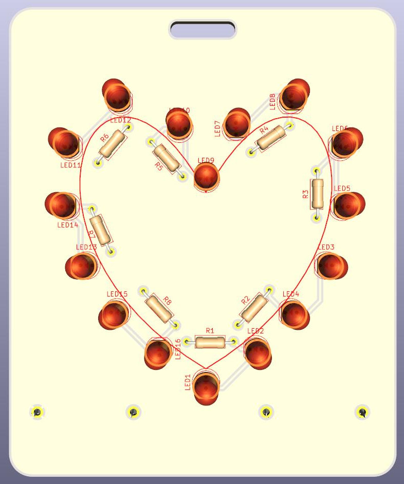
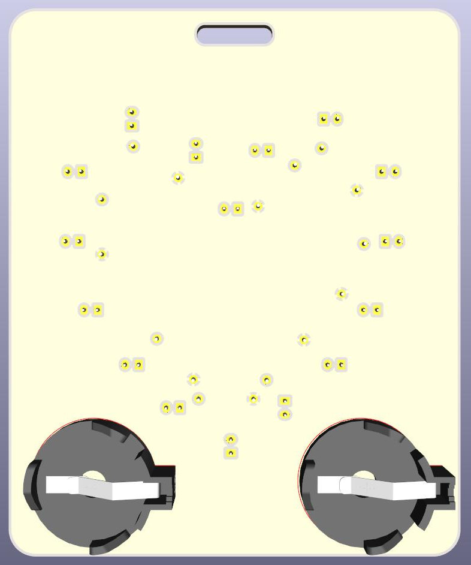

# Solder practice PCB for kids

License: CC-BY-SA 4.0

I designed this PCB to teach my 6 years old son soldering and some electronics basics. The cutout on top fits a standard ID card clip, so the the PCB can be worn as some kind of brooch if desired.
